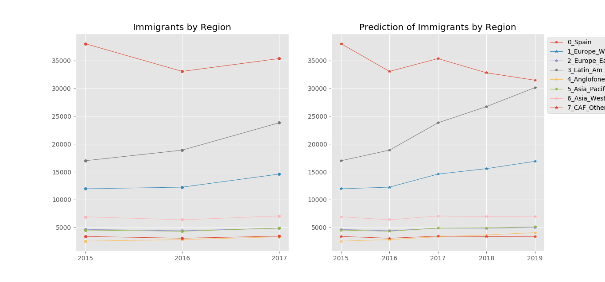
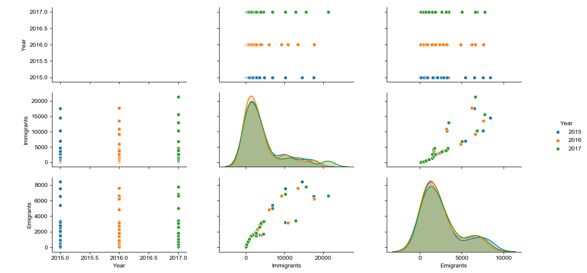
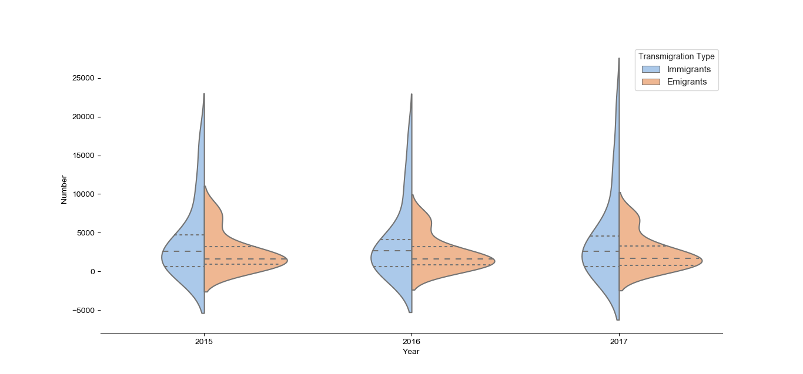
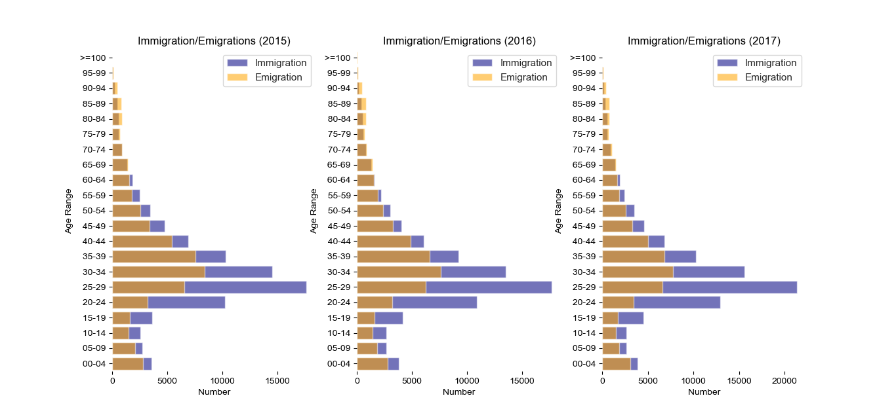
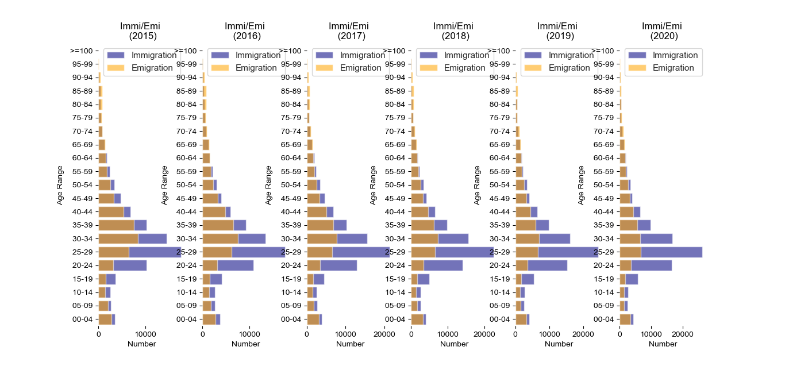
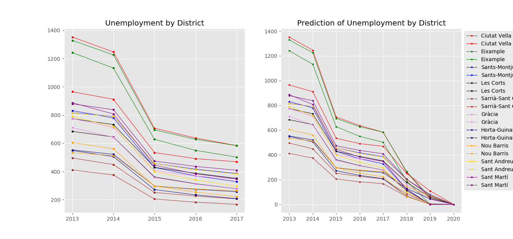

# JCDS03_Final_Project
JCDS03_Final_Project - William
Expatrait Living in the City of Barcelona

Opportunity Analysis for Expatriats living in Barcelona, three part of Analysis is done:

A1. Prediction of Immigration by Nationality and Region/sub-continent
A2. Immigration vs Emigration by Age Range
A3. Prediction of Unemployment by District and Gender

Data Source:
A1: https://opendata-ajuntament.barcelona.cat/data/en/dataset/est-demo-immigrants-nacionalitat

A2: https://opendata-ajuntament.barcelona.cat/data/en/dataset/est-demo-immigrants-sexe

A3: https://opendata-ajuntament.barcelona.cat/data/en/dataset/est-atur-sexe

Original Datasets:
0_A1_immigrants_by_nationality.csv
0_A2_immigrants_emigrants_by_age.csv
0_A3_unemployment.csv

# ======================================
A1. Prediction of Immigration by Nationality and Region/sub-continent
Data Transformation for better visualization

A1_1_data_transform.py, resulting csv:
1_A1_immigrants_by_nationality_tidy.csv
1_A1_immigrants_by_region_process.csv
1_A1_immigrants_by_region_tidy.csv

A1_2_machine_learning.py, resulting csv, PNG:
2_A1_immigrants_by_region_regr_tidy.csv
2_A1_immigrants_by_region_regr_process.csv

# ======================================
A2. Immigration vs Emigration by Age Range

A2_1_data_transform.py, resulting csv:
1_A2_immigrants_emigrants_by_age.csv
1_A2_immigrants_emigrants_by_age_process.csv

A2_1_data_tranform_for_ML.py, resulting csv:
1_A2_immigrants_emigrants_by_age_ML.csv

A2_2_1_EDA.py, resulting PNG:

A2_2_2_barplotting.py, resulting PNG:

A2_3_machine_learning.py, resulting csv:
2_A2_immigrants_emigrants_by_age_ML_regr.csv

A2_4_barplotting_with_ML.py, resulting PNG:

# ======================================
A3. Prediction of Unemployment by District and Gender

A3_1_data_transform.py, resulting csv:
1_A3_unemployments_by_district.csv

A3_2_machine_learning.py, resulting csv, PNG:
2_A3_unemployment_by_district_regr.csv

