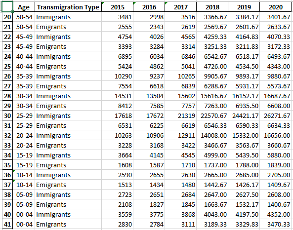

# JCDS03_Final_Project

Expatriat Living in the City of Barcelona - William

Mirror: https://github.com/williamcodingacc/JCDS03_Project
# ======================================
Project Status:

Phase A Done,

Phase B 1 Done, more coming
# ======================================
Brief economic overview for Expatriats moving/living in Barcelona, three part of Analysis is done:

A1. Prediction of Immigration by Nationality and Region/sub-continent

A2. Immigration vs Emigration by Age Range

A3. Prediction of Unemployment by District and Gender

Data Source:

A1: https://opendata-ajuntament.barcelona.cat/data/en/dataset/est-demo-immigrants-nacionalitat

A2: https://opendata-ajuntament.barcelona.cat/data/en/dataset/est-demo-immigrants-sexe

A3: https://opendata-ajuntament.barcelona.cat/data/en/dataset/est-atur-sexe

Original Datasets:

0_A1_immigrants_by_nationality.csv

0_A2_immigrants_emigrants_by_age.csv

0_A3_unemployment.csv

# ======================================
A1. Prediction of Immigration by Nationality and Region/sub-continent

Data Transformation for better visualization

A1_1_data_transform.py, resulting csv:

1_A1_immigrants_by_nationality_tidy.csv

1_A1_immigrants_by_region_process.csv

1_A1_immigrants_by_region_tidy.csv

A1_2_machine_learning.py, resulting csv, PNG:

2_A1_immigrants_by_region_regr_tidy.csv

2_A1_immigrants_by_region_regr_process.csv

# ======================================
B1. Prediction of Immigration by Nationality from Each Region/sub-continent
B1_1_data_transform_Labelling.py, resulting CSV:

1_B1_immigrants_by_nationality_Labeled.csv

B1_2_plot_with_ML_region_national.py, Projecting PNG Plot:

# ======================================
A2. Immigration vs Emigration by Age Range

A2_1_data_transform.py, resulting csv:

1_A2_immigrants_emigrants_by_age.csv

1_A2_immigrants_emigrants_by_age_process.csv

A2_1_data_tranform_for_ML.py, resulting csv:

1_A2_immigrants_emigrants_by_age_ML.csv

A2_2_1_EDA.py, resulting PNG:

A2_2_2_barplotting.py, resulting PNG:

A2_3_machine_learning.py, resulting csv:

2_A2_immigrants_emigrants_by_age_ML_regr.csv

A2_4_barplotting_with_ML.py, resulting PNG:

# ======================================
A3. Prediction of Unemployment by District and Gender

A3_1_data_transform.py, resulting csv:

1_A3_unemployments_by_district.csv

A3_2_machine_learning.py, resulting csv, PNG:

2_A3_unemployment_by_district_regr.csv

# ======================================
Notes:

CSV   : (immutable) used as Major Medium for Processing

EXCEL : (mutable)   used for Reporting, changeable and modifiable

JSON  : (immutable) used as Cross-platform Medium
# ======================================
